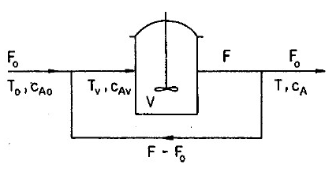

# Parameter Mapping for Dynamical Systems
Source:  Metody analýzy nelineárních dynamických modelů, prof. Milan Kubíček\
Sumarized by Dr. Martin Kohout

# Definition of the problem - CSTR1EXO
The CSTR1EXO model represents an ideal continuously stirred tank reactor (CSTR) with a non-isothermal (exothermic) first-order reaction and recycle. The reactor is schematically illustrated in the figure below:\

The reaction mixture enters the reactor with a volumetric flow rate F0, input concentration cA0​, and input temperature T0​. Similarly, the volumetric flow F, the concentration of the key component cA​, and temperature T at the output are described. Material and energy balances can be written in the following form:\
    V . dcA/dt ​= F . [cAv ​− cA​] − r(cA​,T) . V\
    V . Cp . dT/dt = r(cA,T) . (−ΔHr) . V − U . S . (T − Tc)
    
## Model Derivation:
By introducing dimensionless concentration x, dimensionless temperature θ, and other dimensionless parameters Λ, Da, γ, B, β and θc, both balances can be converted into dimensionless form:\
    f1 ​= dx/dt ​= −Λ . x + Da . (1 − x) . exp(θ / (1 + θ/γ)​)\
    f2 = dθ/dt = −Λ . θ + B . Da . (1 − x) . exp⁡(θ / (1 + θ/γ)) − β . (θ − θc)

We thus obtain two ordinary differential equations (ODEs) of first order, where the conversion xx and dimensionless temperature θ represent the state variables. The parameters Λ, Da, γ, B, β and θc​ are model parameters. We will further search only for steady-state solutions, for which the time derivative of state variables equals zero. Thus, the ODE system reduces to a system of two nonlinear algebraic equations (NAR):\
f1​ = −Λ . x + Da . (1 − x) . exp(θ / (1 + θ/γ)​) = 0\
f2 = −Λ . θ + B . Da . (1 − x) . exp⁡(θ / (1 + θ/γ)) − β . (θ − θc) = 0

# Parameter Mapping
If it's possible to explicitly express the state variables (or parameters), calculate these state variables (or parameters) directly. In our case (CSTR1EXO problem), we'd like to investigate how the behavior of state variables depends on the Damköhler criterion Da. We can multiply the first equation by −B and add it to the second equation (−B.f1+f2).(−B.f1​+f2​):\
    −Λ . x + Da . (1 − x) . exp⁡(θ / (1 + θ/γ)) = 0, /(−B)\
    −Λ . θ + Da . B . (1 − x) . exp⁡(θ / (1 + θ/γ)) − β . (θ − θc) = 0\
This gives us:\
    Λ . x . B − Λ . θ − β . (θ − θc) = 0\
From the resulting equation, the conversion x can be directly calculated as:\
    x = Λ . θ + β . (θ − θc) / Λ . B\
Using the Damköhler criterion Da, it's now easy to compute from one of the original equations f1​ or f2.

# Eigenvalues and Stability
## Calculation of Eigenvalues
The eigenvalues of matrix A are the roots of the characteristic polynomial:\
    P(λ) = det⁡(A − λ . I) = 0

In a two-dimensional case (the CSTR1EXO problem), it's relatively straightforward to derive the following form:\
    (a_11 − λ) . (a_22 − λ) − a_12 . a_21 = 0\
    λ^2 − (a_11 + a_22) . λ + a_11 . a_22 − a_12 . a_21 = 0\
    λ^2 − tr(A) . λ + det(A) = 0

where det(A) and tr(A) represent the determinant and the trace of matrix A, respectively. From this resulting quadratic equation, both eigenvalues λ_1,2 can be calculated directly using analytical solutions:\
    λ_1,2 = tr(A) ± sqrt(D) / 2, where discriminant D = tr(A^2) −4 . det(A)

If the discriminant D ≥ 0, we get two real solutions:\
    λ_1 = 1/2 . (tr(A) + sqrt(D)) and λ_2 = 1/2 . (tr(A) − D)

If, on the other hand, D is negative, the solutions are complex conjugate eigenvalues:\
    λ_1,2 = 1/2 . tr(A) ± i . 1/2 . sqrt(∣D∣)

For the CSTR1EXO problem, matrix A represents a 2×2 Jacobian matrix, whose elements represent partial derivatives of equations f1​ and f2​ with respect to the state variables x and θ. Through analytical differentiation, we thus obtain:\
    a_11 = ∂f1/∂x = −Λ − Da . E\
    a_12 = ∂f1/∂θ = Da . (1 − x) . E / (1 + θ/γ)^2\
    a_21 = ∂f2/∂x = −B . Da . E\
    a_22 = ∂f2/∂θ = −Λ + B . Da . (1 − x) . E / (1 + θ/γ)^2 − β\
where E = exp⁡(θ / (1 + θ/γ)).

## Properties of Eigenvalues:
Based on the values of the eigenvalues λ_1,2​, we can classify the following types of steady states:
-Stable node - λ1,λ2​ are negative real numbers.
-Stable focus - λ_1,2​ are complex conjugate numbers with negative real parts.
-Hyperbolic saddle - λ_1 and λ_2​ are real numbers, one positive and one negative.
-Unstable node - λ_1 and λ_2​ are positive real numbers.
-Unstable focus - λ_1,2​ are complex conjugate numbers with positive real parts.

